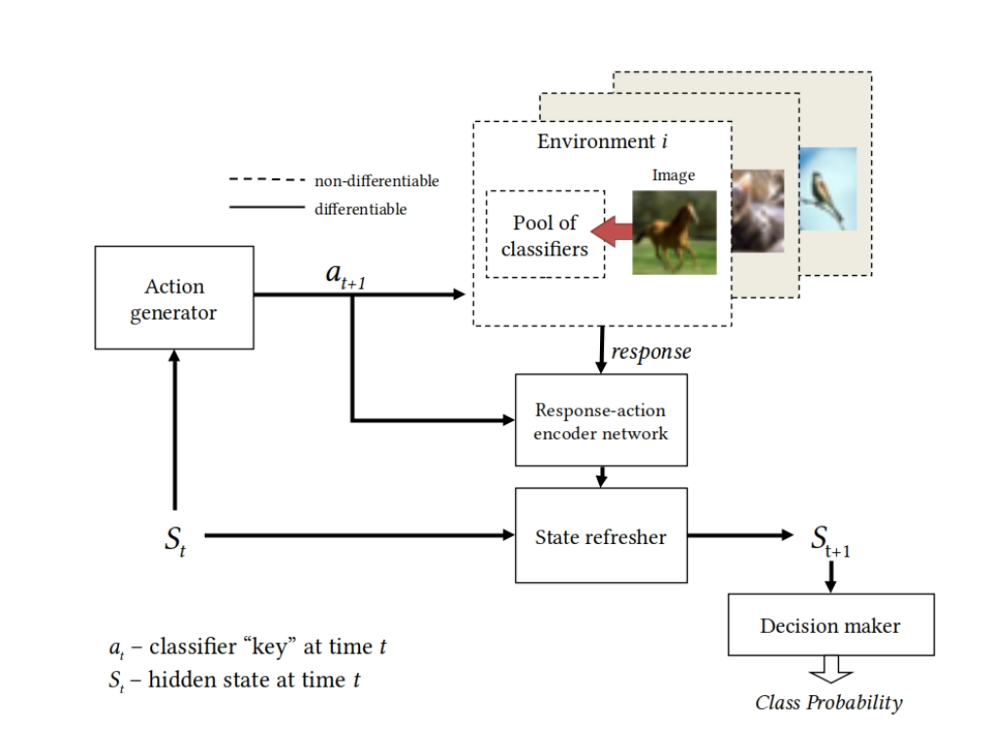
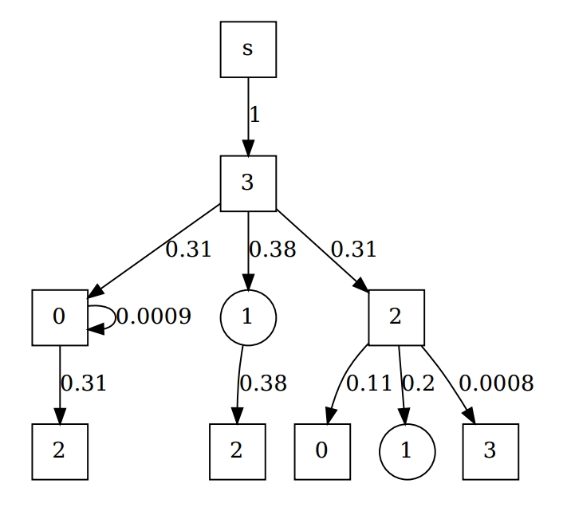

# Least action classifier

This is official implementation of "Sparsely Ensembled Convolutional Neural Network Classifiers Via Reinforcement Learning" (2021)

https://arxiv.org/pdf/2102.03921.pdf

# Description

Least action classifier (LAC) is an agent that percieves images through the pool of externally pretrained CNN classifiers. It's goal is minimizing average number of classifiers needed to recognize single image (in average).

Agent state is a table that stores responses of the classifiers.

LAC consists of the following five **main components**:

1. Environment response generator (non-differentiable), input:  an image and the index of the requested classifier, returns response of the classifier.
2. State refresher; at step _t_ it inputs hidden state vector and encoded classifier response; returns new hidden state vector.
3. Action generator; input: hidden state vector, returns the “index” of the classifier.
4. Decision maker; inputs hidden state vector, returns current solution.
5. Response-action encoder; encodes action and classifier response to the format that is appropriate for state refresher.

<p align="center">
 
</p>
LAC components was trained with the use of the following:

1. CNNs: supervised cross-entropy loss (supervised, pretrained)
2. Descision maker: cross-entropy loss (supervised).
3. Action genreator: a2c loss (reinforcment)

# Dependencies

1. The project is build with the use of pytorch library.
2. Computational graphs are plotted with graphviz.
3. Experiments are managed through the use of script_manager https://github.com/malashinroman/script_manager. You don't need to install it seperately, but don't forget to do "git submodule init", and "git submodule update"

# Training

## Data

LAC uses responses of 6 classifiers trained on cifar-10. Responses are precomputed stored as numpy files.
Files can be downloaded from [google-drive](https://drive.google.com/file/d/14ysSLVz3UhnTRevKzLrQ1TDssYo0hESf/view?usp=sharing).

Untar and place the content into '<project-folder>/weak_classifiers'.

## Start training

You don't need gpu for training.

I use script_manager to pass training parameters to another python scripts that is responsible for training.
Script manager helps managing experiments with projects of the format usually stored on github.

You can run training from root project directory with the following command:

```
python scripts/icmlt.py --not_test
```

It should reproduce experiments which comprises experiments with pool2 (table 3
from the paper). Without `--not_test` script will run only 1 epoch (you can use to
verify setup is ok).

If you use weights and biases you can enable logs via adding --enable_wandb (to activate specify your login in local_config.py).

# Results

The numbers can slighly differ from the paper due to random
initialization and differencies (see the last section).

| Classifiers used | Test acc |
| ---------------- | -------- |
| 2                | 68.02    |
| 3                | 71.5    |
| 4                | 72.74    |

The training dynamics can be tracked via:

1. Output of the console.
2. In ./tensorboard there are logs in tensorboard format
3. After training program saves pdf with computational graph here train_results/date-time/(dataset=test set)visualized_policy_simple.dot.pdf
4. If you use weights and biases you can enable logs via adding `--enable_wandb`.

<p align="center">
 
</p>

### Differencies with the paper

Current project is not the exact implementation of the paper. I modified few things to implement stop_network.
The list of differencies:

- early stopping on validation set
- stop network for dynamic break of computations is implemented (not yet used, demonstration to be added later)

# Citing

If you find this code useful to your research, please give credit to the following paper

```
@PROCEEDINGS{malashin2021lac,
  title={Sparsely Ensembled Convolutional Neural Network Classifiers Via Reinforcement Learning},
  author={Roman Malashin},
  booktitle={2021 6th International Conference on Machine Learning Technologies},
  publisher={ACM}
  year={2021}
  pages={102-110}
}
```
